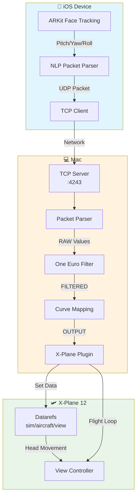
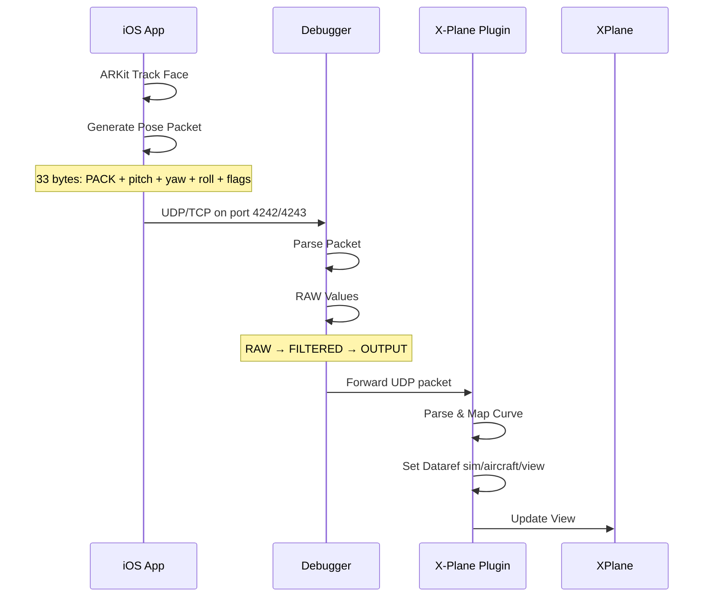

# LiDAR Sight XP - System Architecture

## Overview
LiDAR Sight XP is a head tracking system for X-Plane 12 flight simulator that uses iOS ARKit face tracking to control the cockpit view.

## System Diagram



## Data Flow



## Components

### iOS App (Swift)
- ARKit face tracking with TrueDepth camera
- UDP/TCP packet generation
- Protocol: NLP (33 bytes)

### Debugger (SwiftUI/macOS)
- UDP Listener (port 4242)
- TCP Listener (port 4243)  
- One Euro Filter for smoothing
- Curve mapping with deadzone
- 3D visualization with SceneKit

### X-Plane Plugin (C++)
- XPLM plugin
- TCP Server (port 4243)
- UDP Server (port 4242)
- Datarefs:
  - `sim/aircraft/view/acf_pe_eyr` - Pitch
  - `sim/aircraft/view/acf_pe_eyr` - Yaw  
  - `sim/private/controls/throttle_crank_1` - Roll

## Configuration

| Parameter | Default | Description |
|-----------|---------|--------------|
| Deadzone | 0.2° | Ignore small movements |
| maxInput | 45° | Maximum head turn |
| maxOutput | 120° | Maximum view angle |
| filter.minCutoff | 0.5 | Smoothing strength |
| filter.beta | 0.7 | Derivate smoothing |

## Ports

| Port | Protocol | Purpose |
|-----|----------|---------|
| 4242 | UDP | iOS → Mac |
| 4243 | TCP | iOS → Mac |

## Files

```
xplane12-headtracking/
├── ios/                          # iOS ARKit app
├── macos/
│   ├── HeadTrackerDebugger/     # Debugger app
│   │   └── Views/
│   │       ├── ContentView.swift
│   │       ├── WindshieldView3D.swift
│   │       └── CrosshairOverlay.swift
│   └── LidarSightXP/           # X-Plane plugin
│       ├── Sources/
│       │   ├── LidarSightXP.cpp
│       │   └── LidarSightXP.h
│       └── dist/
│           └── LidarSightXP.xpl
└── docs/                        # Documentation
```